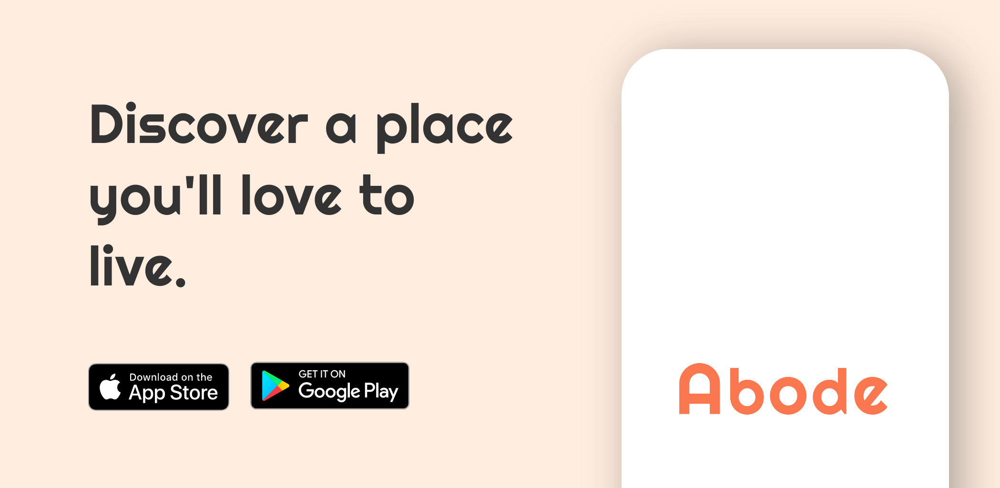

<h1 align="center">Abode for Tenants</h1> 

Abode is a home rental platform that allows landlords to publish listings, and tenants can find and secure their next home with ease.
 

## Features ✨
- Browse Listings.
- Apply for listing.
- View Listings.
- Instant Messaging.
- Payment.
- Search.
- Wishlists.

## Architecture :gear:	

## Tech Stack 🔨
- React❤️Native
- TypeScript
- Ignite
- React Navigation
- Mapbox
- Firebase
- Socket.io-client
- MobX State Tree
- React Hook Form
- Moti
- FlashList

## Screenshot 📸

## Download the app📱
- [App Store](https://www.a.com/us/)
- [Google Play](https://www.a.com/us/) 
- [Check out Abode for landlord app](https://github.com/abumubarak-dev/Abode-landlords)
---

## Author
Built :hammer_and_wrench: with :heart: by Abu Mubarak
- [Twitter](https://twitter.com/abumubarakdev)
- [Linkedin](https://www.linkedin.com/in/abu-mubarak-035652182/)
- [Mail](https://mail.google.com/mail/u/0/?fs=1&to=abumubarak.dev@gmail.com&tf=cm)

